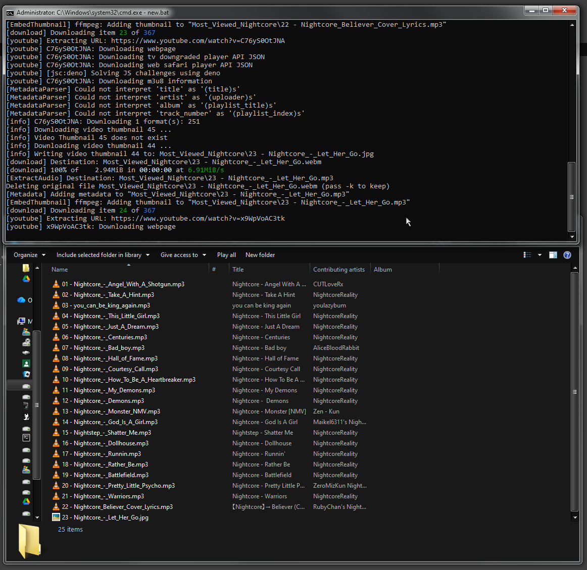
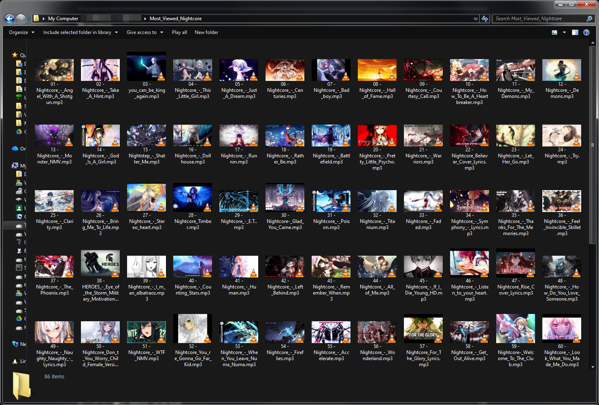

# Bulk YouTube MP3 Downloader from Playlist 

[](LICENSE)
[](#)

A simple and efficient Windows batch script to **download all audio from a YouTube playlist as MP3 files** with embedded metadata and thumbnails. Designed for music enthusiasts who wants to **bulk-download playlists** From Youtube with mp3 format.

---

## Features

- Download all videos from a YouTube playlist as **MP3**.
- Extracts **best quality audio** automatically.
- Embeds **metadata**: title, artist, album, track number.
- Embeds **video thumbnails** into MP3s.
- Automatically **restricts filenames** for clean organization.
- Works on **Windows**, requires `yt-dlp` in PATH.

---

## Preview

**Demonstrate Youtube Playlist [Source](https://www.youtube.com/playlist?list=PL0wqt_um4x0bsdViTJBmnl6KGMoSqxfZy)**

**Batch file running and Metadata embedded in MP3:**

**Downloaded playlist folder:**


---

## Requirements

- **Windows OS**  
- **[yt-dlp](https://github.com/yt-dlp/yt-dlp)** and **[Deno](https://github.com/yt-dlp/yt-dlp/wiki/EJS#deno)** installed and added to PATH or **System32** folder
- Firefox or other browser name (optional, for cookie extraction to handle private/age-restricted videos, can change the browser name through inside the batch file, default is firefox)

---

## Usage

1. **Clone the repository**:

```bash
git clone https://github.com/AToha4521/bulk-yt-mp3-downloader.git
```

2. Open the folder in **File Explorer**.

3. Enter your **YouTube playlist URL** inside the `.bat` file. (use with any text editor example Notepad)

4. If `yt-dlp` is not found, follow the instructions to install it.

5. Run the **batch file** (`yt_bulk_download.bat`) by double-clicking it or via Command Prompt.

6. Wait for downloads — all MP3s will be saved in a folder named after the playlist.

---

## Example Output

```
Playlist_Name\
├── 01 - First Video Title.mp3
├── 02 - Second Video Title.mp3
├── 03 - Third Video Title.mp3
...
```

All MP3 files will include **metadata and thumbnails** for easy identification.

---

## Notes

- Ensure `yt-dlp.exe` is in your **system PATH**.  
- You can modify the batch file to customize download quality, output folder, or metadata formatting.  
- Works best with **Firefox** or other supported browser **(brave, chrome, chromium, edge, opera, safari, vivaldi, whale)** cookies if downloading restricted content.

---

## License

MIT License – see [LICENSE](LICENSE) for details.

---

## Acknowledgements

- [yt-dlp](https://github.com/yt-dlp/yt-dlp) – Powerful YouTube downloader.  
- Inspired by the need to **organize bulk playlist downloads easily with mp3 audio format**.

